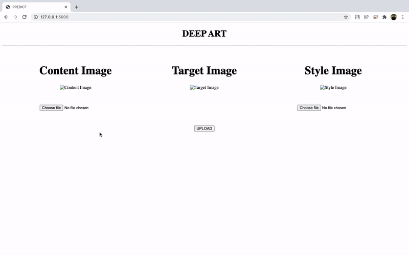

## Sample

  </img>

The above image was generated with `epochs=5000`

## Usage
1. All the required libraries can be found at [requirements.txt](https://github.com/keshav-b/Deep-Art/blob/master/requirements.txt). Clone repo, create an environment in conda, and install these dependencies by: conda install --file requirements.txt
2. Run `app.py`
3. For GPU Usage uncomment [these lines](https://github.com/keshav-b/Deep-Art/blob/45099fcd6c9439bfddace2dfdca85205bf939ec4/style_transfer.py#L73-L75) and comment [this line](https://github.com/keshav-b/Deep-Art/blob/45099fcd6c9439bfddace2dfdca85205bf939ec4/style_transfer.py#L76) [(or use colab)](https://github.com/keshav-b/Deep-Art/blob/master/Style_Transfer.ipynb)

## References
* [Intro to PyTorch:Udacity Course](https://classroom.udacity.com/courses/ud188)
* [Paper: Image Style Transfer Using Convolutional Neural Networks](https://www.cv-foundation.org/openaccess/content_cvpr_2016/papers/Gatys_Image_Style_Transfer_CVPR_2016_paper.pdf)
